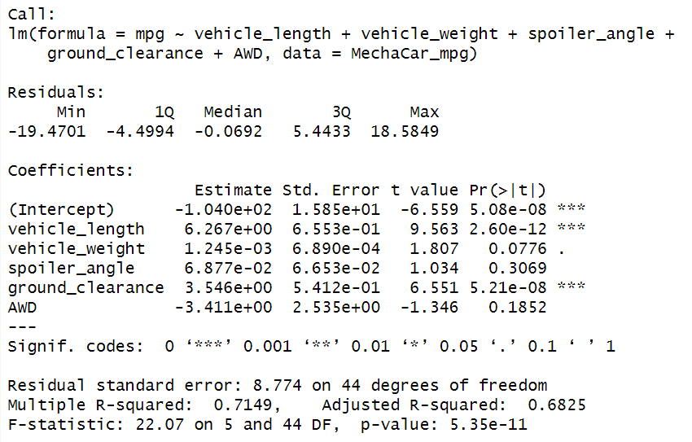
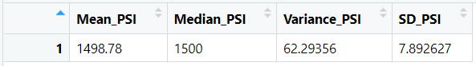
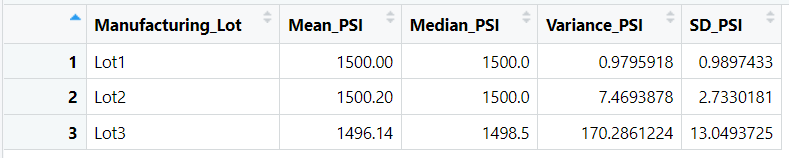
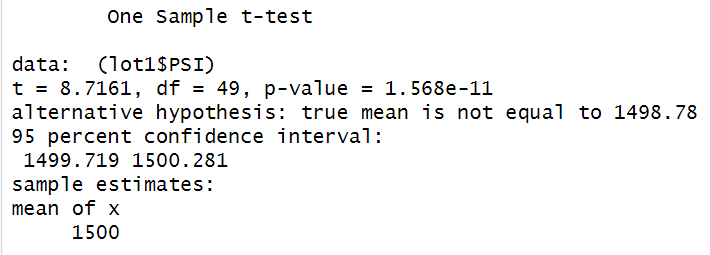
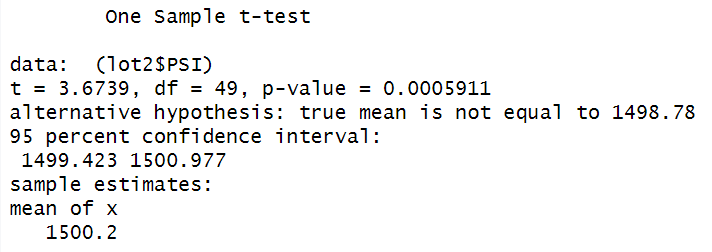
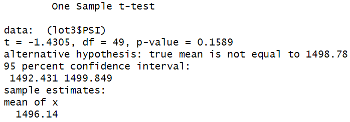

# MechaCar Statistical Analysis

## Linear Regression to Predict MPG

According to linear regression results, vehicle length and ground clearance were the biggest factors that affect mpg non-randomly. The slope of this linear regression model would be positive due to the multiple r-squared value being over 0.50. This is also an indicator that this model is viable for predicting the mpg of MechaCars.

## Summary Statistics on Suspension Coils

The design specifications for MechaCars dictates that the variance in PSI must not exceed 100; so when all manufacturing lots are checked for PSI variance they meet that requirement.

However, the PSI variance in Lot 3 exceeds the 100 PSI limit and does not meet the manufacturing requirements.

## T-Tests on Suspension Coils

Lot 1 T-Test:

Lot 2 T-Test:

Both the Lot 1 t-test and the lot 2 t-test return p-values that are below a 0.05 significance level indicating that the two means are indeed statistically different than our population mean.

Lot 3 T-Test:

However, the t-test on lot 3 returns a p-value that is above the 0.05 significance level; because of this result we fail to reject the null hypotheses, concluding that the mean of lot 3 is not statistically different than the population mean.
